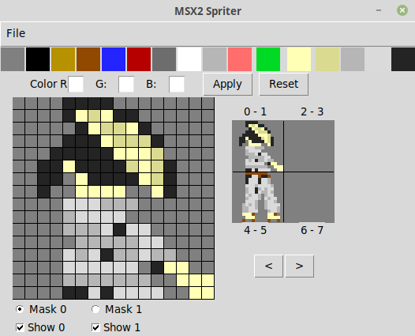

# MSX2 Spriter v1.1

Python3 tool for creating/exporting dual-masked mode 2 (GRAPHIC3/screen4) sprites.

### Release notes:

1.1: Added PATTERN mode!  
1.02: Moved file options to menu bar, added New file functionality 
1.01: Fixed issue with high-order mask not having CC bit set. (Apologies!) 
1.00: Initial release.

## Usage
You must have a fairly recent verson of Python installed in order to use this app. It was developed on Python 3.7.1 but should run on any Python installation that has Tkinter included (which is most of the recent ones). It does not use any additional libraries. It has been fully tested on both Windows 10 and Ubuntu Linux.

To start it, download (or copy) msx2spriter.py to any folder on a computer with Python installed and run:

`$ python3 ./msx2spriter.py`

The following window will open:

The palette at the top of the screen is the default MSX2 palette. To modify these colors, simply select the color, input new RGB values in the edit boxes (values of 0-7), and select **Apply**. The **Reset** button will change the selected color back to the MSX2 system default.

_Note that the first color (color 0) is transparent, and its grey value cannot be changed as of this version!_

Instructions: 
-The left mouse button draws the selected color, and the right mouse button erases (draws transparent). 
-_MSX2 Spriter will automatically color-correct._ This means the image will always be MSX2 compliant, but colors might change when you don't expect them to. Check below for sprite mode limitations. 
-**Note that TWO sprite masks are selected at a time, and all sprites are currently limited to 16x16 mode**. 'Mask' in this context refers to one of the two 16x16 pixel blocks that make up a combined sprite. 
-Only one mask can be drawn on at a time. Use the radio button beneath the draw area to swap between the two currently displayed masks. 
-Use the checkbox buttons to toggle visibility of the two currently displayed masks. 
-Click the small sprite display to swap between the two masks currently being edited. 
-Click the arrows to swap between pages (there are four, to constitute a full MSX2 mode-2 sprite set). 

### Save, Load, and Export

The tool uses a text-based format that just stores the raw data as __\*.m2s__ (MSX2 Spriter format). These files also retain palette data and saving and loading should be fully functional.

To use the sprites in assembly language programs, use **Export z80 sprite data...** from the File menu. It will export assembler data byte format which should be compatible with almost all z80-language compilers, e.g.

 `DB  $00, $00, $00, $02, $06, $04, $0a, $1f`

The color data is included as bytes above the sprite mask data so an entire set can be loaded into MSX2 memory all in one go. 

(Note that as of v1.0 the exporter will export all 32 masks and color data. You'll have to cherry pick them if you only want to include some of them.)

To export the universal palette, use the **Export z80 palette data...** option. As above, it will export assembler data byte format in sequence to be loaded into register #16. 

As of 1.1, you can also create pattern sets for backgrounds!

To switch to pattern mode, select **New pattern file** from the File menu. You will be greeted with a screen similar to the following:

Instructions for **Pattern mode**: 
-As above, the left mouse button draws a color, the right mouse button draws transparent. 
-Also as with sprite mode, the patterns are always MSX2 color-compliant. Check below for pattern mode limitations. 
-One pattern is one 8x8 pixel block. There are 3 tables of 256 (32x8) patterns, but only one 8x4 section of the entire 32x24 (768) editable segment is visible at once. 
-Use the arrow buttons to scroll the visible patterns up, down, left and right. 
-As above, click the pattern you wish to edit. Only one pattern can be edited at a time. 
-When exporting patterns as z80 data, **two** files will be exported - filename.z80 and filename_colors.z80. The _colors file must be loaded at a different area of memory, so it is exported seperately. Text inside of the files reminds you that the default VDP locations for pattern generator is $0000 and colors is $2000. The files themselves are also tagged per-row so you know which tile goes where. 

If you are using this with a compiler such as sjasm, you might want to include a line such as the following at the top of the exported .z80 file and compile it to be included as a raw binary:

` output sprites.bin`

### MSX2 Mode-2 Sprite Limitations

Keep in mind the following restrictions:
1. Each _individual mask_ can only have one color per row, but a total of 16 colors (one for each row, including transparent). 
2. When two masks are overlaid, the overlapping pixels have their palette values OR-ed (e.g. palette number 1 overlaid with palette number 2 will produce palette number 3 (0001 | 0010 = 0011). Refer to this link for more information: 
https://www.msx.org/wiki/The_OR_Color 
3. In sprite mode 2, 8 sprite masks can be displayed on a single scanline, which means with overlaid sprites that restriction is reduced to an effective 4.

### MSX2 GRAPHIC3 Pattern Limitations

GRAPHIC3 background patterns are surprisingly lenient: 
1. Each pattern can have 16 colors (the entire palette, transparent included). 
2. Only two colors can co-exist on the same pixel row - this includes transparent (color 0). 

### Other Notes

The code is extremely ugly. I am not a professional coder by any means and this is mostly for personal use. I'm releasing it publically so maybe someone else will get some use out of it. 

Feel free to contribute, clean up, or give me a shout-out :)
