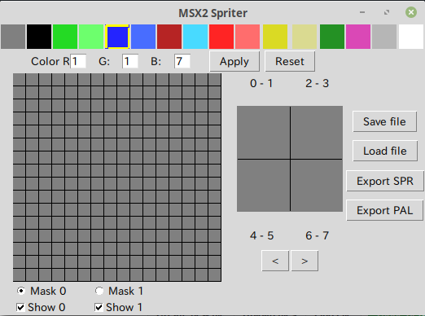

# MSX2 Spriter v1.0

Python tool for creating/exporting dual-masked mode 2 (GRAPHIC3/screen4) sprites.

## Usage
To start it, download (or copy) msx2spriter.py to any folder on your computer and run:

`$ python3 ./msx2spriter.py`

The following window will open:

The palette at the top of the screen is the default MSX2 palette. To modify these colors, simply select the color, input new RGB values in the edit boxes (values of 0-7), and select **Apply**. The **Reset** button will change the selected color back to the MSX2 system default.

_Note that the first color (color 0) is transparent, and its grey value cannot be changed as of this version!_

Instructions: 
-The left mouse button draws the selected color, and the right mouse button erases (draws transparent). 
-**Note that TWO sprite masks are selected at a time, and all sprites are currently limited to 16x16 mode**. 'Mask' in this context refers to one of the two 16x16 pixel blocks that make up a combined sprite. 
-Only one mask can be drawn on at a time. Use the radio button beneath the draw area to swap between the two currently displayed masks. 
-Use the checkbox buttons to toggle visibility of the two currently displayed masks. 
-Click the small sprite display to swap between the two masks currently being edited. 
-Click the arrows to swap between pages (there are four, to constitute a full MSX2 mode-2 sprite set). 

### Save, Load, and Export

The tool uses a text-based format that just stores the raw data as __\*.m2s__ (MSX2 Spriter format). These files also retain palette data and saving and loading should be fully functional.

To use the sprites in assembly language programs, use the **Export SPR** button. It will export assembler data byte format which should be compatible with almost all z80-language compilers, e.g.

 `DB  $00, $00, $00, $02, $06, $04, $0a, $1f`

The color data is included as bytes above the sprite mask data so an entire set can be loaded into MSX2 memory all in one go. 

(Note that as of v1.0 the exporter will export all 32 masks and color data. You'll have to cherry pick them if you only want to include some of them.)

To export the universal palette, use the **Export PAL** button. As above, it will export assembler data byte format in sequence to be loaded into register #16. 

### MSX2 Mode-2 Sprite Limitations

Keep in mind the following restrictions:
1. Each _individual mask_ can only have one color per row, but a total of 16 colors (one for each row, including transparent). 
2. When two masks are overlaid, the overlapping pixels have their palette values OR-ed (e.g. palette number 1 overlaid with palette number 2 will produce palette number 3 (0001 | 0010 = 0011). Refer to this link for more information: 
https://www.msx.org/wiki/The_OR_Color 
3. In sprite mode 2, 8 sprite masks can be displayed on a single scanline, which means with overlaid sprites that restriction is reduced to an effective 4.

### Other Notes

The code is extremely ugly. I am not a professional coder by any means and this is mostly for personal use. I'm releasing it publically so maybe someone else will get some use out of it. 

Feel free to contribute, clean up, or give me a shout-out :)
