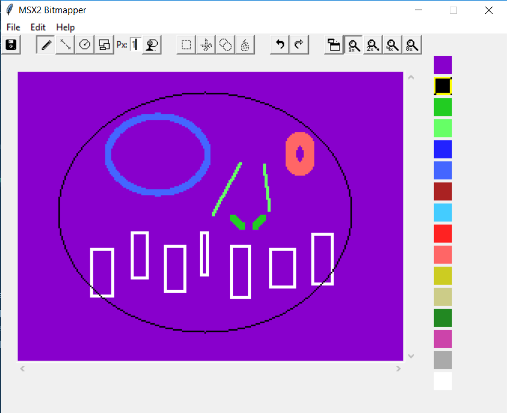

# MSX2 Bitmapper v1.0

## Features
-Support for all four 9938 VDP bitmap modes - G4-G7 (aka SCREEN 5-8) 
-Support for both vertical resolutions - 192 and 212 (displayed by setting bit 7 in R#9) 
-Support for interlaced bitmaps @ 384 and 424 px resolutions (bits 2 and 3 ste to 1 in R#9) 
-Proper color/palette configuration for all modes 
-Easy pop-up palette swapping (and palette z80 export) 
-(Only slightly buggy) window scaling 
-1x, 2x, 4x, 8x pixel zoom 
-Box selection and cut/copy/paste 
-1-9 px brush size 
-Square and diamond shape brushes 
-Line, circle, and square shape drawing 
-Flood-fill and color swap 
-100-step undo and redo 
-File formats: native compressed (gzip), export support for both z80 assembler and raw bytes
 
 
## How to use
 
On start, the app will load a G4 mode bitmap with 192 vertical resolution. In order, the icons in the toolbar are: 
Save, Draw, Line, Circle, Square, (brush size), Fill, Select, Cut, Copy, Paste, Undo, Redo, Scale window, and four zoom levels.  
To change a color in the palette, right click the color, and select the new palette color. In all but G7 modes, you have access to the full 512 color MSX2 palette, and that palette value will automatically swapped if already painted to the canvas. In G7 mode, blues are halved, and colors will not be swapped on the canvas.  
In most draw modes, right click and drag will move the canvas if at a zoom level higher than 1x. Left click will draw (or fill), and when in shape mode, left click and drag will expand the shape. 
Keyboard shortcuts are: 
Ctrl+S: Save 
Ctrl+Z: Undo 
Ctrl+Y: Redo 
(Available in selection mode): 
Ctrl+X: Cut  
Ctrl+C: Copy  
Ctrl+V: Paste  
 
When in selection mode, drag to box-select the desired area, then use cut or copy. A single click elsehwere on the canvas will automatically show the pastable area (a drag will create a new selection but will otherwise have no affect on the clipboard). 
<b>Fill mode</b> is slow! It's generally faster, if you are swapping an entire color, to simply do this on the palette. Fill is animated so you can see your progress, as is Undo.
 
 
The window will default to 2x pixel size (minimum). Depending on the resolution of your monitor, clicking the scale button will increase the pixel size by 1 until filling your screen, then clicking it again will reset it to 2x. This has been tested at 720p and 1080p, but you might see artifacts or weird empty space at 1440p and above. The pixel grid is also generally only viewable at 4x 8x zoom, but this depends on your screen resolution/scale as well.  

Exports in z80 are formatted as: 
` DB  $00, $00, $00...` 
This should be a universal format compatible with all compilers. If your compiler doesn't like $-notation, you can always use the raw bytes export.  
<b>Note that raw byte export for interlaced mode exports both bitmap tables as one file.</b> If this is unacceptable, you can easily split them using the z80 export, or by simply chopping the file in half.
  
## Other Notes
-It's very slow! Interlaced images, being double the amount of pixels, can have a very low framerate on refresh. Windows 10 with integrated graphics in particular has trouble with the Tkinter library, but on Linux/Mac and a graphics-accelerated PC this should be much less noticable. Zoomed-in displays fewer canvas objects as well, which should be faster overall. 
-Fill and undo is animated so it feels less laggy. 
-If you want to view the .m2b files in raw, simply add a .zip extension and extract what's inside. 
