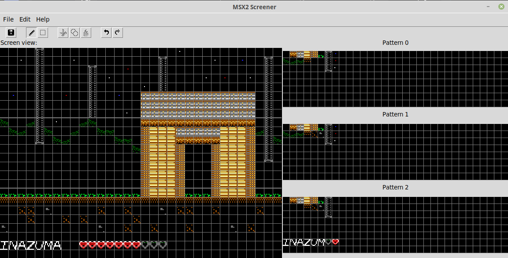

# MSX2 Screener v1.22

## Features
-Native compressed format 
-Export in z80 code and raw bytes 
-RLE encryption for raw byte export 
-Support for hot-swapping pattern files 
-100-step undo and redo 
-Selection and cut/copy/paste 
-Automatic tile swapping when drawing each pattern region 

## Usage (Screener tool):
As above, copy or download `msx2screener.py` locally to your computer. To make use of the screener tool, you need a pattern (M2P) file created with the Spriter tool. You execute it with: 

`$ python3 ./msx2screener.py` 

The window looks like this: 

Instructions for **Screener tool**: 
-You need to load in an M2P pattern file from the Spriter tool before painting a screen. (Sorry, no support for standard images yet!) 
-Screen patterns are limited to one-third sections of the screen. Patterns 0-255 are for the top third, 256-511 for the middle, and 512-767 for the bottom. 
-Click any of the patterns on each of the pattern windows to select a 'paintbrush' for that section of the screen. After doing this, painting is natural and fluid - you can drag your mouse between the screen's third-sections and continue painting with the selected neighboring pattern. 
-Right click to set that tile to whatever is set to tile '0' in that section.  
-When creating a new screen file, all tiles will be filled in by default with tile '0'. It is recommended this tile is fully transparent (color 0). 
-You can freely change screen files and pattern files. Import a new M2P to change the current screen's pattern graphics, or load/create a new M2C and the tool will ask if you want to change your current pattern set. 
-Exporting is nice and easy - 768 bytes, one per tile, each valued 0-255. Formatting is the same as described above. 
-RLE Encryption scheme converts multiples of the same tile in a row to a TileNo,TileNo,Repeats byte sequence. E.g. $ff, $ff, $ff, $ff, $ff, $ff, $aa, $ff will be converted into $ff, $ff, $06, $aa, $ff.
