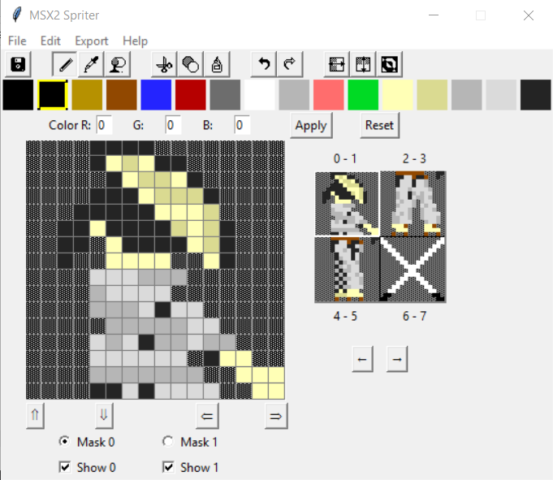
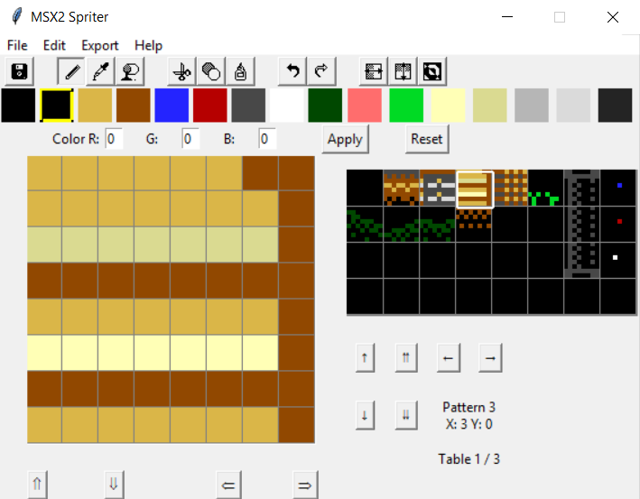

# MSX2 Spriter v1.4

## Features
-Hackneyed MSX1/Mode 1 sprite support (masks-only export) 
-Support for a full 32-mask, dual-layered sprite set at once 
-Single/double mask view toggle 
-Automatic color correction and OR coloring for sprite masks; automatic color correction for patterns 
-Transparency color selection 
-Color picker, fill tool  
-Cut, copy, paste of masks 
-100-step undo and redo 
-Horizontal and vertical flip 
-Four directional shift 
-Bitwise invert (0>1 and vice versa) 
-Native compressed file format 
-Export to z80 assembly code AND bytes-only 
-Palette import and export 
-Pattern support for full 768 tiles 
-Optional triplicate for pattern export 

## Usage
 
The palette at the top of the screen is the default MSX2 palette. To modify these colors, simply select the color, input new RGB values in the edit boxes (values of 0-7), and select **Apply**. The **Reset** button will change the selected color back to the MSX2 system default. You can also <b>drag and drop</b> palette entries to rearrange them. This will automatically swap their associated colors for all current sprites.

_Note that the first color (color 0) is transparent for sprites. Its value can be changed, but for practical purposes this is cosmetic._

Instructions: 
-The left mouse button draws the selected color, and the right mouse button erases (draws transparent). 
-_MSX2 Spriter will automatically color-correct._ This means the image will always be MSX2 compliant, but colors might change when you don't expect them to. Check below for sprite mode limitations. 
-**Note that TWO sprite masks are selected at a time, and all sprites are currently limited to 16x16 mode**. 'Mask' in this context refers to one of the two 16x16 pixel blocks that make up a combined sprite. 
-Only one mask can be drawn on at a time. Use the radio button beneath the draw area to swap between the two currently displayed masks. 
-Use the checkbox buttons to toggle visibility of the two currently displayed masks. 
-Holding the Shift key temporarily toggles to the color picker (eyedropper). 
-Click the small sprite display to swap between the two masks currently being edited. 
-Click the arrows to swap between pages (there are four, to constitute a full MSX2 mode-2 sprite set). 
-The arrows underneath the draw area allow you to shift in all four directions. This does not add to the undo queue, since this is very easy to fix yourself with a click. 
-The toolbar at the top of the screen represents, in order: Save, Pixel, Pick color, Fill, Cut, Copy, Paste, Undo, Redo, Flip Horiz., Flip Vertical, Invert. These options are all in the Edit menu as well (Save is in File). 
-To use a palette from another M2S or M2P file in your current file, choose 'Import palette from...' option from the File menu. 

### Save, Load, and Export

The tool uses a text-based format that just stores the raw data as __\*.m2s__ (MSX2 Spriter format), which is then zipped. These files also retain palette data and saving and loading should be fully functional.

To use the sprites in assembly language programs, use **Export z80 sprite data...** (or raw bytes) from the Export menu. It will export assembler data byte format which should be compatible with almost all z80-language compilers, e.g.

 `DB  $00, $00, $00, $02, $06, $04, $0a, $1f`

The color data is included as bytes above the sprite mask data so an entire set can be loaded into MSX2 memory all in one go. 

(The exporter will only export masks and pattern tables that are NOT empty, but these are annotated in the z80 export. Raw bytes export will export the entire sequence, including blank masks, up until the last non-empty mask.)

There is a toggle in the Export menu to only export the sprite masks, omitting the color data. This is useful for Sprite Mode 1 where color masks are not used. 

To export the universal palette, use the **Export z80 palette data...** (or raw bytes) option. As above, it will export assembler data byte format in sequence to be loaded into register #16. 

As of 1.1, you can also create pattern sets for backgrounds!

To switch to pattern mode, select **New pattern file** from the File menu. You will be greeted with a screen similar to the following:

 

Instructions for **Pattern mode**: 
-As above, the left mouse button draws a color, the right mouse button draws transparent. 
-Also as with sprite mode, the patterns are always MSX2 color-compliant. Check below for pattern mode limitations. 
-One pattern is one 8x8 pixel block. There are 3 tables of 256 (32x8) patterns, but only one 8x4 section of the entire 32x24 (768) editable segment is visible at once. 
-Use the arrow buttons to scroll the visible patterns up, down, left and right. 
-As above, click the pattern you wish to edit. Only one pattern can be edited at a time. 
-When exporting patterns as z80 data, **two** files will be exported - filename.z80 and filename_colors.z80. The _colors file must be loaded at a different area of memory, so it is exported seperately. Text inside of the files reminds you that the default VDP locations for pattern generator is $0000 and colors is $2000. The files themselves are also annotated per-row so you know which tile goes where. 
-There is a toggle in the Export menu to only export Table 1 (to save space). 
-When saving an M2S file, if there is no pattern data in Tables 2 and 3, the app will ask you if you would like to duplicate Table 1. This is mostly as an aid to prevent tedious copy and paste and make it easier to use with the Screener tool. 

### MSX2 Mode-2 Sprite Limitations

Keep in mind the following restrictions:
1. Each _individual mask_ can only have one color per row, but a total of 16 colors (one for each row, including transparent). 
2. When two masks are overlaid, if the higher-order mask has bit 6 of its color bytes set, the overlapping pixels have their palette values OR-ed (e.g. palette number 1 overlaid with palette number 2 will produce palette number 3 (0001 | 0010 = 0011). MSX2 Spriter does this automatically for higher-order masks (every odd). Refer to this link for more information: 
https://www.msx.org/wiki/The_OR_Color 
3. In sprite mode 2, 8 sprite masks can be displayed on a single scanline, which means with overlaid sprites that restriction is reduced to an effective 4.

### MSX2 GRAPHIC3 Pattern Limitations

GRAPHIC3 background patterns are surprisingly lenient: 
1. Each pattern can have 16 colors (the entire palette, transparent included). 
2. Only two colors can co-exist on the same pixel row - this includes transparent (color 0). 
3. Each third of the screen needs its own pattern table.
